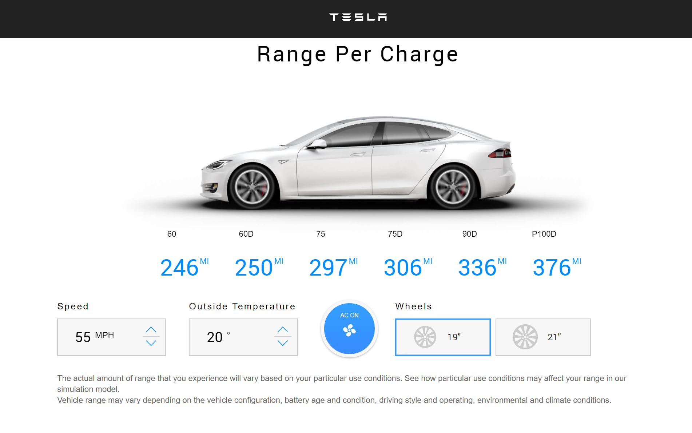

<h2>Hello, welcome!</h2>
<h4>This project calculates the battery range for Tesla cars given different car settings (models, speed, wheels, and AC).</h4>

<b>Technologies</b> used to build this project: React, HTML, and CSS. [Surge](surge.sh) is also used to deploy the app.  

Below is the final image of the project. Please also check out the live version [here](http://tram-tesla-car-battery-calculator.surge.sh/).

  
 

